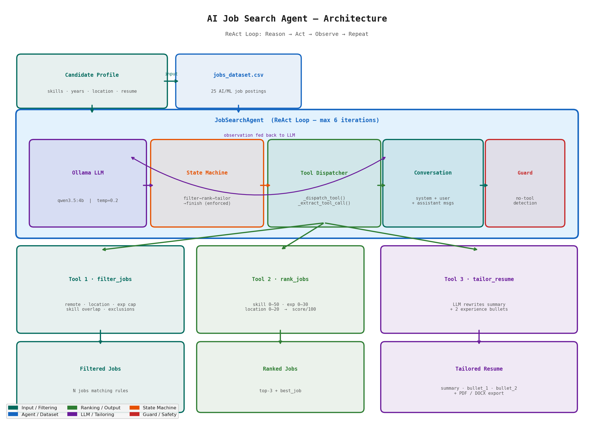

# AI Job Search Agent

**Team 19** | AI for Engineers — Assignment 2

An autonomous AI agent that filters, ranks, and tailors your resume for the best-matching job — powered by a local LLM (Qwen 3.5 4B via Ollama). No data leaves your machine.

---

## Architecture



```
Candidate Profile
      │
      ▼
Qwen 3.5 4B     ──▶  filter_jobs  ──▶  rank_jobs  ──▶  tailor_resume
  (ReAct loop)        Rule-based      Scored 0–100     LLM rewrites
                      filtering         ranking        summary + bullets
                                                              │
                                              ┌───────────────┴──────────────┐
                                              ▼                              ▼
                                          CLI Report               API + Web UI
```

**Stack:**

| File                  | Purpose                                        |
| --------------------- | ---------------------------------------------- |
| `main.py`             | CLI agent — ReAct loop, 3 tools, dry-run mode  |
| `api_server.py`       | FastAPI backend with SSE streaming             |
| `index.html`          | Self-contained interactive UI (no build step)  |
| `tests/test_agent.py` | 11 pytest unit tests                           |
| `jobs_dataset_with_real_urls.csv` | 30 real AI/ML job postings with LinkedIn URLs |
| `report.docx`         | Technical report for the assignment            |

---

## Quick Start

### Step 1 — Install Ollama

```bash
brew install ollama
# or: curl -fsSL https://ollama.com/install.sh | sh
```

### Step 2 — Download the model (~2.5 GB, one-time)

```bash
ollama pull qwen3.5:4b
```

> The agent uses `qwen3.5:4b` by default (set in `main.py` as `MODEL_NAME`). Pull whichever tag you have available; update `MODEL_NAME` to match.

### Step 3 — Install Python dependencies

```bash
pip install -r requirements.txt
```

Requires Python 3.9+.

### Step 4 — Verify (no Ollama needed)

```bash
python3 main.py --dry-run
```

You should see filter + rank output with no errors.

### Step 5 — Run the tests

```bash
python3 -m pytest tests/test_agent.py -v
```

All 11 tests should pass.

---

## Running the Agent

### Option A — CLI only

**Terminal 1:**
```bash
ollama serve
```

**Terminal 2:**
```bash
python3 main.py
```

Edit `CANDIDATE_PROFILE` at the bottom of `main.py` to set your profile.

Optional flags:
```bash
python3 main.py --dry-run        # filter + rank only, no LLM
python3 main.py --timeout 300    # increase timeout for slow machines
```

---

### Option B — Full web UI (recommended)

**Terminal 1:**
```bash
ollama serve
```

**Terminal 2:**
```bash
uvicorn api_server:app --reload --port 8000
```

**Terminal 3 (optional) — serve the frontend:**
```bash
python3 -m http.server 5500
```

**Browser:** Open `http://127.0.0.1:5500` (or just open `index.html` directly in the browser).

Then:
1. Fill in your profile (name, skills, years of experience, location)
2. Drag-drop your resume PDF or DOCX to auto-extract summary + bullets
3. Click **⚡ Run Agent**
4. Watch the live trace as the agent filters, ranks, and tailors
5. Download the tailored PDF or DOCX when done

---

## How It Works

The agent runs a **ReAct loop** (Reason → Act → Observe → Repeat, max 6 iterations):

1. **LLM reasons** about the candidate profile and decides which tool to call
2. **Tool is executed** and the result is fed back as an observation
3. Loop repeats until all three tools have been called and `finish` is signalled

A **state machine** enforces the correct order: `filter_jobs` → `rank_jobs` → `tailor_resume` → `finish`. The agent cannot skip steps or call `finish` early.

---

## Tools

### Tool 1 — `filter_jobs` (rule-based)

Five rules applied in sequence:

| Rule | Logic |
| ---- | ----- |
| Remote-only | Keep only jobs where location contains "remote" |
| Location match | Keep jobs matching any token of preferred location, or remote |
| Experience cap | Drop jobs requiring more than `candidate_years + 1` years |
| Skill overlap | Keep jobs sharing ≥1 skill with the candidate |
| Company exclusion | Remove explicitly excluded companies |

### Tool 2 — `rank_jobs` (scoring)

| Dimension      | Max Points | Formula |
| -------------- | ---------- | ------- |
| Skill Match    | 50         | `(matched / total_job_skills) × 50` |
| Experience Fit | 30         | 30 (exact), 22 (±1yr), 12 (±2yr), ≤5 (±3yr+) |
| Location Match | 20         | 20 (city), 15 (remote), 5 (other) |

Returns `ranked_jobs`, `top_3`, and `best_job`.

### Tool 3 — `tailor_resume` (LLM-powered)

Sends the best job + candidate's existing resume content to the LLM with a strict prompt: make minimal surgical edits, preserve metrics, do not invent accomplishments. Returns a rewritten `professional_summary`, `bullet_1_rewritten`, and `bullet_2_rewritten`.

---

## API Reference

| Method | Path                   | Description                              |
| ------ | ---------------------- | ---------------------------------------- |
| GET    | `/health`              | Ollama connectivity check                |
| GET    | `/jobs`                | All 40 job postings as JSON              |
| POST   | `/run-agent`           | SSE stream: filter → rank → tailor       |
| POST   | `/parse-resume`        | Extract summary + bullets from PDF/DOCX  |
| POST   | `/export-resume`       | Download tailored PDF (in-place edit)    |
| POST   | `/export-resume-docx`  | Download tailored DOCX (in-place edit)   |

**Health check:**
```bash
curl http://localhost:8000/health
# {"status":"ok","model":"qwen3.5:4b","ollama_connected":true,...}
```

**Parse resume:**
```bash
curl -F "file=@resume.pdf" http://localhost:8000/parse-resume
curl -F "file=@resume.docx" http://localhost:8000/parse-resume
```

**Run agent (SSE):**
```bash
curl -N -X POST http://localhost:8000/run-agent \
  -H "Content-Type: application/json" \
  -d '{
    "name": "Somil",
    "skills": ["Python","SQL","Machine Learning","PyTorch"],
    "years_experience": 2,
    "preferred_location": "Remote",
    "current_summary": "Data scientist with 2 years of ML experience...",
    "bullet_1": "Built ETL pipeline reducing latency by 40%...",
    "bullet_2": "Deployed NLP model achieving 90% accuracy..."
  }'
```

---

## Project Structure

```
Job_Search_Agent/
├── main.py                            # CLI agent (ReAct loop + 3 tools)
├── api_server.py                      # FastAPI backend (SSE streaming)
├── index.html                         # Self-contained web UI (no build step)
├── jobs_dataset_with_real_urls.csv    # 30 real AI/ML job postings (LinkedIn URLs)
├── requirements.txt
├── README.md
├── report.docx                        # Technical report (Team 19)
├── architecture_diagram.png           # Architecture diagram
├── tests/
│   └── test_agent.py                  # 11 pytest tests
└── Assignment Requirement/
    └── ...
```

---

## Running Tests

```bash
pytest tests/test_agent.py -v
```

| Test | What it checks |
| ---- | -------------- |
| `test_filtering_location_remote_only` | Only remote jobs with `remote_only=True` |
| `test_filtering_experience_cap` | No jobs requiring >3yr for a 2yr candidate |
| `test_filtering_company_exclusion` | Excluded company absent from results |
| `test_filtering_skill_overlap` | Only jobs with skill overlap returned |
| `test_ranking_score_range` | All scores 0–100 |
| `test_ranking_top_job_highest_score` | First job has highest score |
| `test_ranking_skill_proportional` | 5/5 match beats 1/5 match |
| `test_ranking_top3_count` | `top_3` has ≤ 3 items |
| `test_dataset_integrity` | 30 rows, 7 columns, valid data |
| `test_state_machine_blocks_finish` | `finish` rejected when steps incomplete |
| `test_state_machine_allows_finish_after_all_steps` | `finish` accepted after all 3 steps |

---

## Team 19 — Contributions

| Member | Contributions |
| ------ | ------------- |
| Somil Doshi | Full project implementation — agent architecture, ReAct loop (`main.py`), all three tools (filter, rank, tailor), FastAPI backend (`api_server.py`), web UI (`index.html`), dataset collection with real LinkedIn URLs, pytest test suite, architecture diagram, README, and technical report |

---

## Troubleshooting

| Symptom | Fix |
| ------- | --- |
| `ConnectionError` on start | Run `ollama serve` in a separate terminal |
| `model not found` | Run `ollama pull qwen3.5:4b` |
| Agent loops without finishing | Increase `MAX_AGENT_ITERATIONS` in `main.py` |
| DOCX bullets not auto-filled | Ensure resume has bullet markers (•, -, *) or plain list paragraphs |
| PDF export fails | Run: `pip install pdfplumber pypdf` |
| Timeout on resume tailoring | Use: `python main.py --timeout 300` |
| Frontend shows "API offline" | Start: `uvicorn api_server:app --port 8000` |
